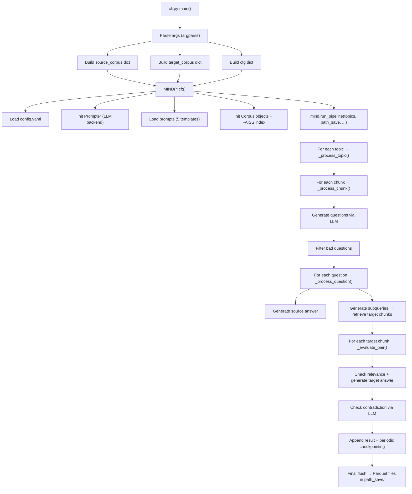
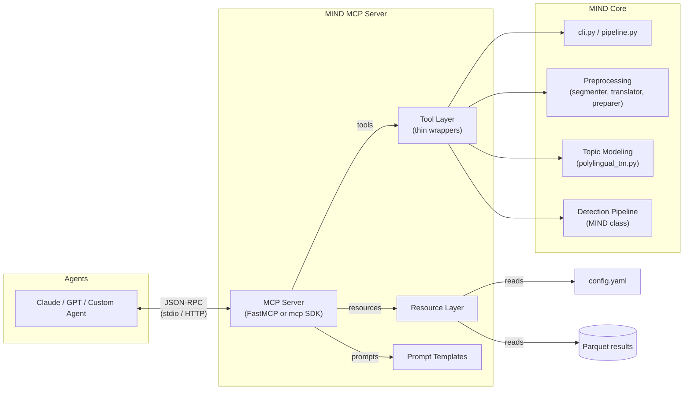

# MIND — CLI Mode & MCP Integration Research

> **Date:** 2026-02-28  
> **Purpose:** Document how the current CLI works and lay out a strategy for exposing the MIND service through the [Model Context Protocol (MCP)](https://modelcontextprotocol.io) so that AI agents can operate it programmatically.

---

## Table of Contents

1. [CLI Mode — How It Works Today](#1-cli-mode--how-it-works-today)
   - [Entry-Point](#11-entry-point--srcclipy)
   - [Argument Reference](#12-argument-reference)
   - [Internal Flow](#13-internal-flow-cli--mind-pipeline)
   - [Web Mode vs CLI Mode](#14-web-mode-vs-cli-mode)
   - [Configuration File](#15-configuration-file)
   - [Example Invocations](#16-example-invocations)
2. [MCP Integration — Future Strategy](#2-mcp-integration--future-strategy)
   - [What Is MCP?](#21-what-is-mcp)
   - [Why MCP for MIND?](#22-why-mcp-for-mind)
   - [Proposed MCP Surface](#23-proposed-mcp-surface)
   - [Architecture Sketch](#24-architecture-sketch)
   - [Implementation Roadmap](#25-implementation-roadmap)
   - [Considerations](#26-considerations)

---

## 1. CLI Mode — How It Works Today

### 1.1 Entry-Point — `src/mind/cli.py`

The CLI is a single-file argparse application (`136 lines`) that directly instantiates the core `MIND` pipeline class and calls `run_pipeline()`.

```
src/mind/cli.py  ─→  MIND(**cfg)  ─→  mind.run_pipeline(**run_kwargs)
```

It can be invoked with:

```bash
python3 src/mind/cli.py --topics 7 --path_save results/ \
    --src_corpus_path ... --src_thetas_path ... --tgt_corpus_path ... \
    --tgt_thetas_path ... --tgt_lang_filter ES
```

There is **no `console_scripts` entry-point** registered in `pyproject.toml`, so the CLI is run by calling the Python module directly.

### 1.2 Argument Reference

| Argument | Required | Default | Description |
|----------|----------|---------|-------------|
| `--llm_model` | No | `qwen:32b` | LLM model identifier |
| `--llm_server` | No | `None` | LLM server URL (e.g., `http://host:11434`) |
| `--topics` | **Yes** | — | Comma-separated topic IDs (e.g., `15,17`) |
| `--sample_size` | No | `None` | Subsample size for passages |
| `--path_save` | **Yes** | — | Output directory for results |
| `--dry_run` | No | `False` | Run without LLM calls |
| `--no_entailment` | No | `False` | Disable NLI entailment check |
| `--print_config` | No | `False` | Print resolved config before running |
| **Source corpus** ||||
| `--src_corpus_path` | **Yes** | — | Path to source Parquet corpus |
| `--src_thetas_path` | **Yes** | — | Path to source topic thetas (`.npz`) |
| `--src_id_col` | No | `doc_id` | ID column name |
| `--src_passage_col` | No | `text` | Passage text column name |
| `--src_full_doc_col` | No | `full_doc` | Full document column name |
| `--src_lang_filter` | No | `EN` | Language filter for source |
| `--src_filter_ids_path` | No | `None` | File of IDs to exclude |
| `--previous_check` | No | `None` | File of IDs from previous runs |
| **Target corpus** ||||
| `--tgt_corpus_path` | **Yes** | — | Path to target Parquet corpus |
| `--tgt_thetas_path` | **Yes** | — | Path to target topic thetas (`.npz`) |
| `--tgt_id_col` | No | `doc_id` | ID column name |
| `--tgt_passage_col` | No | `text` | Passage text column name |
| `--tgt_full_doc_col` | No | `full_doc` | Full document column name |
| `--tgt_lang_filter` | **Yes** | — | Target language (e.g., `ES`, `DE`) |
| `--tgt_index_path` | No | `None` | FAISS index save path |
| `--tgt_filter_ids_path` | No | `None` | File of IDs to exclude  |
| `--load_thetas` | No | `False` | Load thetas from file |

### 1.3 Internal Flow (CLI → MIND Pipeline)



**Key details:**

- **Corpus loading**: `Corpus.from_parquet_and_thetas()` reads a Parquet file + sparse thetas (`.npz`), filters by language, and if target, builds a FAISS index via `IndexRetriever`.
- **LLM interaction**: All LLM calls go through the `Prompter` class, which supports Ollama, OpenAI, vLLM, llama.cpp, and Google Gemini — selected by the `llm.default` block in `config.yaml` or by explicit `--llm_model` / `--llm_server` args.
- **Checkpointing**: Results are saved every 200 entries as Parquet files (async via `AsyncCheckpointer` if enabled). A final flush ensures no data is lost.
- **Output format**: Parquet files in `<path_save>/` containing columns: `topic`, `question_id`, `question`, `subquery`, `source_chunk`, `target_chunk`, `a_s`, `a_t`, `label`, `reason`, `source_chunk_id`, `target_chunk_id`.

### 1.4 Web Mode vs CLI Mode

Both modes share the same core `MIND` class, but differ in how they wrap it:

| Aspect | CLI (`cli.py`) | Web (`detection.py`) |
|--------|---------------|---------------------|
| **Interface** | argparse CLI | Flask REST API (`/detection/analyse_contradiction`) |
| **Config source** | CLI args | JSON request body + `config.yaml` |
| **Execution model** | Blocking, single-process | `multiprocessing.Process` (background) |
| **Corpus resolution** | User passes all paths directly | Resolved from user email + dataset names |
| **Logging** | Standard logging to console/file | `StreamForwarder` → forwards to frontend HTML terminal |
| **Process management** | None | `active_processes` dict with locking, cancellation, max-user limits |
| **LLM selection** | `--llm_model` / `--llm_server` | Server selector UI → Ollama/Gemini/GPT config |
| **Preprocessing** | Separate scripts (`segmenter.py`, `translator.py`, `data_preparer.py`) | Flask routes in `preprocessing.py` |
| **Topic modeling** | Separate script (`polylingual_tm.py`) | Flask route in `preprocessing.py` |

### 1.5 Configuration File

All behavior is controlled via `config/config.yaml` (inside Docker: `/src/config/config.yaml`):

- **`logger`** — Log level, directory, file rotation.
- **`optimization`** — Performance profiles (`balanced`, `memory_optimized`, `speed_optimized`) controlling chunk size, async checkpoints, batched embeddings, etc.
- **`mind`** — Core pipeline params: `top_k`, `batch_size`, `min_clusters`, prompt file paths, embedding models (multilingual vs monolingual), NLI model.
- **`llm`** — Default backend + model, LLM parameters (temperature, seed, etc.), and per-backend server configs (Ollama, vLLM, llama.cpp, Gemini, OpenAI).

### 1.6 Example Invocations

**Bilingual EN→ES run (from `run_rosie.sh`):**

```bash
python3 src/mind/cli.py \
  --llm_model "llama3.3:70b" \
  --topics "24" \
  --sample_size 348 \
  --path_save "data/mind_runs/rosie/results" \
  --src_corpus_path ".../df_1.parquet" \
  --src_thetas_path ".../thetas_EN.npz" \
  --src_lang_filter EN \
  --tgt_corpus_path ".../df_1.parquet" \
  --tgt_thetas_path ".../thetas_ES.npz" \
  --tgt_lang_filter ES \
  --tgt_index_path "data/mind_runs/rosie/indexes" \
  --src_filter_ids_path "data/mind_runs/rosie/results/src_filter_ids_tp24.txt" \
  --tgt_filter_ids_path "data/mind_runs/rosie/results/src_filter_ids_tp24.txt" \
  --load_thetas
```

**Bilingual EN→DE run (from `run_en_de.sh`):**

```bash
LLM_SERVER="http://your-ollama-host:11434" \
python3 src/mind/cli.py \
  --llm_model "llama3.3:70b" \
  --llm_server "$LLM_SERVER" \
  --topics "7" \
  --sample_size 200 \
  --path_save "data/mind_runs/ende/results" \
  --src_corpus_path ".../polylingual_df.parquet" \
  --src_thetas_path ".../thetas_EN.npz" \
  --src_lang_filter EN \
  --tgt_corpus_path ".../polylingual_df.parquet" \
  --tgt_thetas_path ".../thetas_DE.npz" \
  --tgt_lang_filter DE \
  --tgt_index_path "data/mind_runs/ende/indexes"
```

**Full preprocessing pipeline (CLI):**

```bash
# 1. Segment
python3 src/mind/corpus_building/segmenter.py \
  --input INPUT_PATH --output OUTPUT_PATH \
  --text_col TEXT_COLUMN --id_col ID_COLUMN

# 2. Translate
python3 src/mind/corpus_building/translator.py \
  --input INPUT_PATH --output OUTPUT_PATH \
  --src_lang SRC_LANG --tgt_lang TGT_LANG

# 3. Prepare
python3 src/mind/corpus_building/data_preparer.py \
  --anchor ANCHOR_PATH --comparison COMPARISON_PATH \
  --output OUTPUT_PATH --schema SCHEMA_JSON_OR_PATH

# 4. Train topic model
python3 src/mind/topic_modeling/polylingual_tm.py \
  --input PREPARED_PATH --lang1 EN --lang2 ES \
  --model_folder MODEL_DIR --num_topics 30

# 5. Run detection
python3 src/mind/cli.py --topics ... --path_save ...
```

---

## 2. MCP Integration — Future Strategy

### 2.1 What Is MCP?

The **Model Context Protocol (MCP)** is an open standard (introduced by Anthropic, November 2024) that lets AI models — particularly LLMs — securely connect to external tools and data sources. It works via a client-server model:

- An **MCP Client** (the agent / AI assistant) discovers and invokes capabilities.
- An **MCP Server** (your application) exposes three primitive types:
  - **Tools** — Functions the agent can invoke (perform actions, return results).
  - **Resources** — Read-only data endpoints (config files, status pages, datasets).
  - **Prompts** — Reusable templates that guide the agent's behavior.

Communication happens over **JSON-RPC 2.0** via stdio or HTTP (Streamable HTTP / SSE).

### 2.2 Why MCP for MIND?

The existing interfaces (CLI argparse + Flask web API) are designed for **humans**. To enable AI agents to autonomously:

1. **Upload and preprocess datasets**
2. **Train topic models**
3. **Run discrepancy detection**
4. **Query and analyze results**
5. **Monitor pipeline status**

...they need a machine-readable, discoverable API. MCP provides exactly this: a standardized protocol that any MCP-compatible agent (Claude, GPT, Gemini agents, custom agents) can use to interact with MIND without bespoke integrations.

### 2.3 Proposed MCP Surface

Below is a proposed mapping of the current MIND functionality to MCP primitives.

#### Tools (Actions agents can invoke)

| Tool Name | Description | Input Parameters | Returns |
|-----------|-------------|-----------------|---------|
| `preprocess_segment` | Segment documents into passages | `input_path`, `output_path`, `text_col`, `id_col`, `lang` | `{status, output_path, num_segments}` |
| `preprocess_translate` | Translate passages between languages | `input_path`, `output_path`, `src_lang`, `tgt_lang`, `text_col`, `llm_model?`, `llm_server?` | `{status, output_path, num_translated}` |
| `preprocess_prepare` | Prepare polylingual dataset | `anchor_path`, `comparison_path`, `output_path`, `schema` | `{status, output_path, num_docs}` |
| `train_topic_model` | Train a polylingual topic model | `input_path`, `lang1`, `lang2`, `model_folder`, `num_topics` | `{status, model_path, num_topics}` |
| `run_detection` | Run the MIND discrepancy pipeline | `src_corpus_path`, `src_thetas_path`, `tgt_corpus_path`, `tgt_thetas_path`, `topics`, `path_save`, `llm_model?`, `llm_server?`, `sample_size?`, `selected_categories?` | `{status, run_id, results_path}` |
| `cancel_detection` | Cancel a running pipeline | `run_id` | `{status}` |
| `get_pipeline_status` | Check pipeline status | `run_id` | `{status: running\|finished\|error, progress?}` |
| `list_results` | List available result files | `results_dir` | `[{path, topics, num_rows, created_at}]` |
| `query_results` | Query detection results with filters | `results_path`, `label_filter?`, `topic_filter?`, `limit?`, `offset?` | `{rows, total_count, columns}` |
| `export_results` | Export results to Excel/CSV | `results_path`, `format` | `{download_path}` |
| `list_topic_models` | List trained topic models | `data_dir` | `[{name, num_topics, languages, created_at}]` |
| `get_topic_info` | Get keywords and metadata for topics | `model_path`, `topic_ids?` | `[{id, keywords, label, size}]` |

#### Resources (Read-only data)

| Resource URI | Description |
|-------------|-------------|
| `mind://config` | Current `config.yaml` contents |
| `mind://config/llm` | Active LLM backend and parameters |
| `mind://config/optimization` | Active optimization profile |
| `mind://models/available` | Available LLM models (Ollama, Gemini, etc.) |
| `mind://results/{run_id}/summary` | Summary statistics of a detection run |
| `mind://results/{run_id}/labels` | Unique labels found in results |
| `mind://logs/{run_id}` | Pipeline log for a run |

#### Prompts (Reusable templates)

| Prompt Name | Description |
|------------|-------------|
| `full_analysis` | Guided walkthrough: preprocess → topic model → detect → report |
| `quick_scan` | Run detection on a single topic with default settings |
| `compare_runs` | Compare two detection runs side by side |

### 2.4 Architecture Sketch



**Key design principle:** The MCP server is a **thin wrapper** around the existing Python modules. No business logic lives in the MCP layer — it only translates between MCP primitives and existing function calls.

### 2.5 Implementation Roadmap

#### Phase 1 — Core Detection Tools (MVP)

> **Goal:** An agent can run a detection pipeline and query results.

1. **Install [FastMCP](https://gofastmcp.com) or the [mcp Python SDK](https://github.com/modelcontextprotocol/python-sdk)**
   ```bash
   uv add "mcp[cli]"
   # or
   uv add fastmcp
   ```

2. **Create `src/mind/mcp_server.py`** — A new module that:
   - Instantiates `FastMCP("mind")`
   - Registers tools: `run_detection`, `get_pipeline_status`, `query_results`, `list_results`
   - Registers resources: `mind://config`, `mind://models/available`
   - Wraps the existing `MIND` class for tool implementations

3. **Async execution:** Long-running tools (`run_detection`, `train_topic_model`) should return a `run_id` immediately and use background execution (similar to the current `multiprocessing.Process` approach in `detection.py`).

4. **Register in `pyproject.toml`:**
   ```toml
   [project.scripts]
   mind-cli = "mind.cli:main"
   mind-mcp = "mind.mcp_server:main"
   ```

**Example tool implementation sketch:**

```python
from fastmcp import FastMCP
from mind.pipeline.pipeline import MIND

mcp = FastMCP("mind")

@mcp.tool()
def run_detection(
    src_corpus_path: str,
    src_thetas_path: str,
    tgt_corpus_path: str,
    tgt_thetas_path: str,
    tgt_lang_filter: str,
    topics: str,
    path_save: str,
    llm_model: str | None = None,
    sample_size: int | None = None,
) -> dict:
    """Run the MIND discrepancy detection pipeline on the given corpora and topics."""
    cfg = {
        "llm_model": llm_model,
        "source_corpus": { "corpus_path": src_corpus_path, ... },
        "target_corpus": { "corpus_path": tgt_corpus_path, ... },
    }
    mind = MIND(**cfg)
    topic_ids = [int(t.strip()) for t in topics.split(",")]
    mind.run_pipeline(topics=topic_ids, path_save=path_save, sample_size=sample_size)
    return {"status": "finished", "results_path": path_save}

@mcp.resource("mind://config")
def get_config() -> str:
    """Returns the current MIND configuration."""
    with open("config/config.yaml") as f:
        return f.read()
```

#### Phase 2 — Preprocessing & Topic Modeling Tools

> **Goal:** An agent can run the **entire** workflow end-to-end.

- Add tools: `preprocess_segment`, `preprocess_translate`, `preprocess_prepare`, `train_topic_model`
- Add resources: `mind://results/{run_id}/summary`, `mind://logs/{run_id}`
- Add prompt templates for guided workflows

#### Phase 3 — Observability & Advanced Features

> **Goal:** Production-ready MCP server with progress streaming and multi-user support.

- **Progress notifications**: Use MCP's notification mechanism to stream progress (topic N of M, chunk X of Y).
- **Structured error reporting**: Tool errors return typed, actionable error objects.
- **Authentication**: If deployed remotely, add OAuth2 / API key authentication to the HTTP transport.
- **Multi-user isolation**: Namespace runs by user/session.
- **Caching**: Leverage `Prompter`'s existing `joblib.Memory` cache for repeated queries.

### 2.6 Considerations

#### Transport Choice

| Transport | When to use |
|-----------|-------------|
| **stdio** | Local agent ↔ local MIND server (development, single-user) |
| **Streamable HTTP** | Remote agents, multi-tenant deployments, cloud |

For initial development, **stdio** is the simplest. For deployment, migrate to HTTP.

#### What Remains in CLI vs MCP

The CLI (`cli.py`) should **remain** as a lightweight, scriptable entry-point for batch jobs and shell pipelines. The MCP server is an **additional** interface layer — not a replacement.

```
                    ┌──────────────┐
                    │  config.yaml │
                    └──────┬───────┘
                           │
         ┌─────────────────┼─────────────────┐
         │                 │                 │
    ┌────▼────┐     ┌──────▼──────┐    ┌─────▼─────┐
    │  CLI    │     │  Flask Web  │    │  MCP      │
    │ (bash)  │     │  (browser)  │    │  (agents) │
    └────┬────┘     └──────┬──────┘    └─────┬─────┘
         │                 │                 │
         └─────────────────┼─────────────────┘
                           │
                    ┌──────▼───────┐
                    │ MIND Pipeline│
                    │ (core lib)   │
                    └──────────────┘
```

#### Mapping Current CLI Args → MCP Tool Params

The existing CLI arguments map directly to MCP tool input parameters. The difference is that MCP provides:

- **Discoverability**: Agents can list available tools, read their schemas, and understand what parameters are required.
- **Typed inputs/outputs**: JSON Schema defines the exact shape of inputs and outputs.
- **Composability**: Agents can chain tool calls (preprocess → topic model → detect → query) in an autonomous workflow.

#### Dependency on Current Architecture

The MCP server benefits from the existing clean separation:

- `MIND` class is **already self-contained** — it takes a config dict and runs.
- `Prompter` already supports **multiple LLM backends** via config.
- `Corpus` already supports **Parquet + thetas loading** from paths.
- `config.yaml` centralizes all configuration.

This means the MCP layer is genuinely thin — mostly argument marshaling + async wrappers.
