# MIND Project - Architecture Diagrams

> **Document Version:** 1.0  
> **Last Updated:** 2026-01-29  
> **Purpose:** Visual representation of MIND system architecture, data flows, and module relationships

---

## Table of Contents

1. [System Architecture](#1-system-architecture)
2. [Data Processing Pipeline](#2-data-processing-pipeline)
3. [Module Dependencies](#3-module-dependencies)
4. [Web Application Architecture](#4-web-application-architecture)
5. [MIND Pipeline Workflow](#5-mind-pipeline-workflow)
6. [Retrieval System Architecture](#6-retrieval-system-architecture)
7. [LLM Integration](#7-llm-integration)
8. [Deployment Architecture](#8-deployment-architecture)
9. [Database Schema](#9-database-schema)
10. [Configuration Flow](#10-configuration-flow)

---

## 1. System Architecture

### 1.1 High-Level System Overview

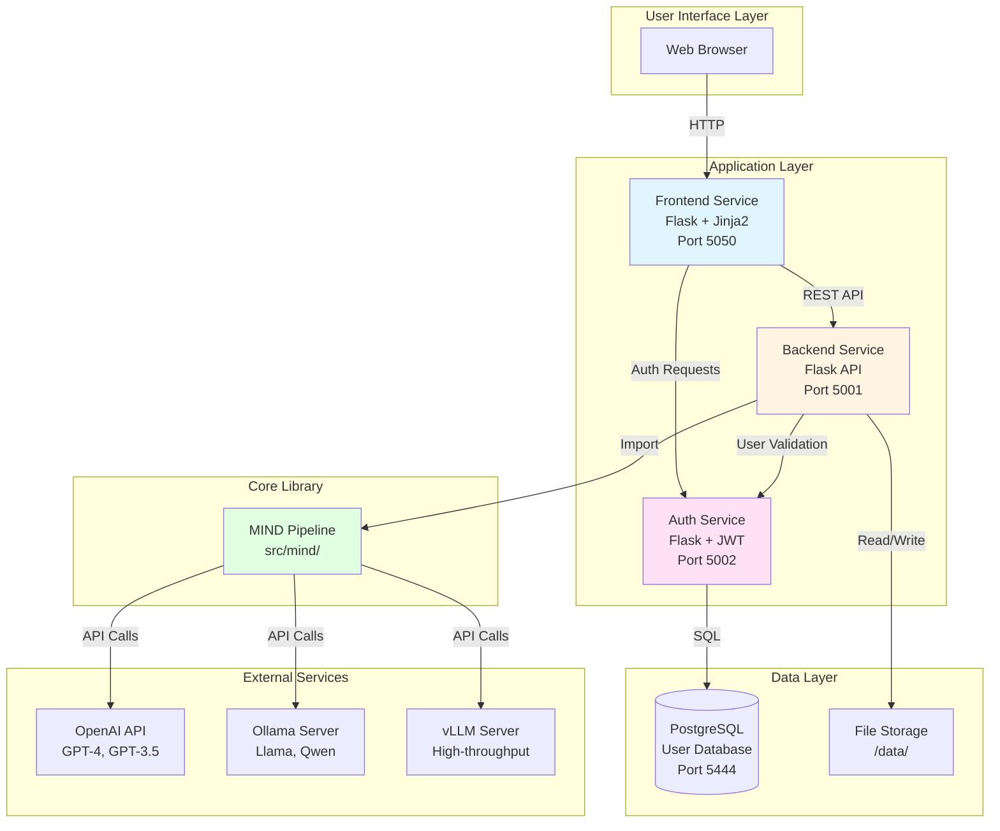
```mermaid
graph TB
    subgraph "User Interface Layer"
        UI[Web Browser]
    end
    
    subgraph "Application Layer"
        Frontend[Frontend Service<br/>Flask + Jinja2<br/>Port 5050]
        Backend[Backend Service<br/>Flask API<br/>Port 5001]
        Auth[Auth Service<br/>Flask + JWT<br/>Port 5002]
    end
    
    subgraph "Data Layer"
        DB[(PostgreSQL<br/>User Database<br/>Port 5444)]
        Files[File Storage<br/>/data/]
    end
    
    subgraph "Core Library"
        MIND[MIND Pipeline<br/>src/mind/]
    end
    
    subgraph "External Services"
        OpenAI[OpenAI API<br/>GPT-4, GPT-3.5]
        Ollama[Ollama Server<br/>Llama, Qwen]
        vLLM[vLLM Server<br/>High-throughput]
    end
    
    UI -->|HTTP| Frontend
    Frontend -->|REST API| Backend
    Frontend -->|Auth Requests| Auth
    Backend -->|User Validation| Auth
    Auth -->|SQL| DB
    Backend -->|Read/Write| Files
    Backend -->|Import| MIND
    MIND -->|API Calls| OpenAI
    MIND -->|API Calls| Ollama
    MIND -->|API Calls| vLLM
    
    style Frontend fill:#e1f5ff
    style Backend fill:#fff4e1
    style Auth fill:#ffe1f5
    style MIND fill:#e1ffe1
```

### 1.2 Microservices Communication

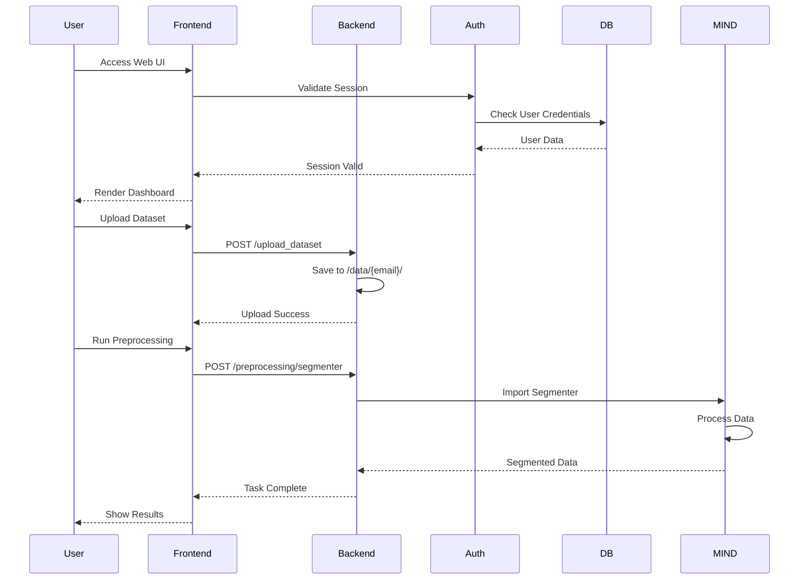
```mermaid
sequenceDiagram
    participant User
    participant Frontend
    participant Backend
    participant Auth
    participant DB
    participant MIND
    
    User->>Frontend: Access Web UI
    Frontend->>Auth: Validate Session
    Auth->>DB: Check User Credentials
    DB-->>Auth: User Data
    Auth-->>Frontend: Session Valid
    Frontend-->>User: Render Dashboard
    
    User->>Frontend: Upload Dataset
    Frontend->>Backend: POST /upload_dataset
    Backend->>Backend: Save to /data/{email}/
    Backend-->>Frontend: Upload Success
    
    User->>Frontend: Run Preprocessing
    Frontend->>Backend: POST /preprocessing/segmenter
    Backend->>MIND: Import Segmenter
    MIND->>MIND: Process Data
    MIND-->>Backend: Segmented Data
    Backend-->>Frontend: Task Complete
    Frontend-->>User: Show Results
```

---

## 2. Data Processing Pipeline

### 2.1 End-to-End Data Flow

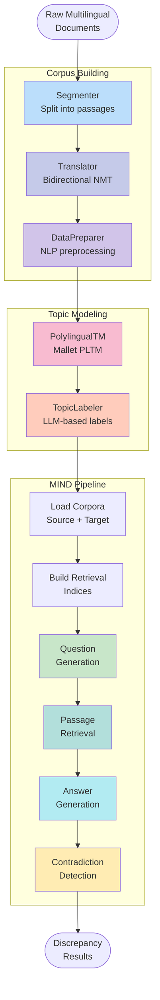
```mermaid
flowchart TD
    Start([Raw Multilingual<br/>Documents]) --> Segment
    
    subgraph "Corpus Building"
        Segment[Segmenter<br/>Split into passages]
        Translate[Translator<br/>Bidirectional NMT]
        Prepare[DataPreparer<br/>NLP preprocessing]
        
        Segment --> Translate
        Translate --> Prepare
    end
    
    subgraph "Topic Modeling"
        Mallet[PolylingualTM<br/>Mallet PLTM]
        Label[TopicLabeler<br/>LLM-based labels]
        
        Prepare --> Mallet
        Mallet --> Label
    end
    
    subgraph "MIND Pipeline"
        Load[Load Corpora<br/>Source + Target]
        Index[Build Retrieval<br/>Indices]
        QGen[Question<br/>Generation]
        Retrieve[Passage<br/>Retrieval]
        AGen[Answer<br/>Generation]
        Detect[Contradiction<br/>Detection]
        
        Label --> Load
        Load --> Index
        Index --> QGen
        QGen --> Retrieve
        Retrieve --> AGen
        AGen --> Detect
    end
    
    Detect --> Results([Discrepancy<br/>Results])
    
    style Segment fill:#bbdefb
    style Translate fill:#c5cae9
    style Prepare fill:#d1c4e9
    style Mallet fill:#f8bbd0
    style Label fill:#ffccbc
    style QGen fill:#c8e6c9
    style Retrieve fill:#b2dfdb
    style AGen fill:#b2ebf2
    style Detect fill:#ffecb3
```

### 2.2 Corpus Building Detail

```mermaid
flowchart LR
    subgraph Input
        Raw[Raw Corpus<br/>Parquet]
    end
    
    subgraph "Segmentation Phase"
        S1[Load DataFrame]
        S2[Split by separator]
        S3[Filter short paragraphs]
        S4[Assign chunk IDs]
        S5[Save segmented.parquet]
        
        Raw --> S1
        S1 --> S2
        S2 --> S3
        S3 --> S4
        S4 --> S5
    end
    
    subgraph "Translation Phase"
        T1[Load segmented data]
        T2[Split into sentences]
        T3[Translate batches<br/>HuggingFace NMT]
        T4[Reassemble paragraphs]
        T5[Append translations]
        T6[Save translated.parquet]
        
        S5 --> T1
        T1 --> T2
        T2 --> T3
        T3 --> T4
        T4 --> T5
        T5 --> T6
    end
    
    subgraph "Preparation Phase"
        P1[Load anchor + comparison]
        P2[Normalize columns]
        P3[Run NLPipe<br/>spaCy lemmatization]
        P4[Merge lemmas]
        P5[Create pair keys]
        P6[Save prepared.parquet]
        
        T6 --> P1
        P1 --> P2
        P2 --> P3
        P3 --> P4
        P4 --> P5
        P5 --> P6
    end
    
    subgraph Output
        Final[Prepared Dataset<br/>Ready for PLTM]
    end
    
    P6 --> Final
```

---

## 3. Module Dependencies

### 3.1 Core Library Structure

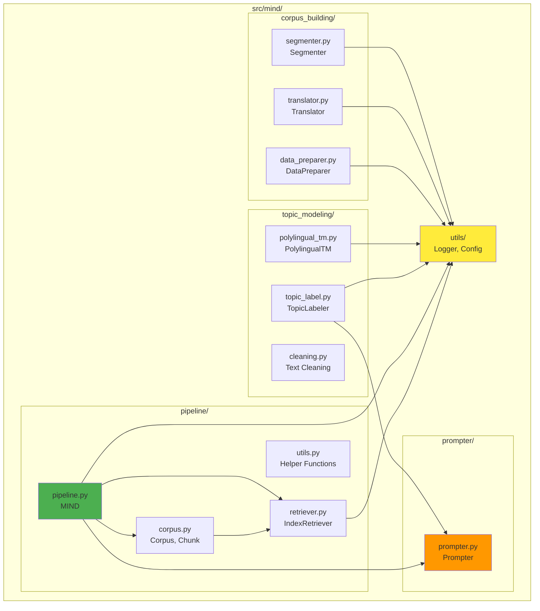
```mermaid
graph TD
    subgraph "src/mind/"
        Utils[utils/<br/>Logger, Config]
        
        subgraph "corpus_building/"
            Seg[segmenter.py<br/>Segmenter]
            Trans[translator.py<br/>Translator]
            Prep[data_preparer.py<br/>DataPreparer]
        end
        
        subgraph "topic_modeling/"
            PLTM[polylingual_tm.py<br/>PolylingualTM]
            TLabel[topic_label.py<br/>TopicLabeler]
            Clean[cleaning.py<br/>Text Cleaning]
        end
        
        subgraph "prompter/"
            Prompt[prompter.py<br/>Prompter]
        end
        
        subgraph "pipeline/"
            Corpus[corpus.py<br/>Corpus, Chunk]
            Retriever[retriever.py<br/>IndexRetriever]
            Pipeline[pipeline.py<br/>MIND]
            PUtils[utils.py<br/>Helper Functions]
        end
    end
    
    Seg --> Utils
    Trans --> Utils
    Prep --> Utils
    PLTM --> Utils
    TLabel --> Utils
    TLabel --> Prompt
    Pipeline --> Utils
    Pipeline --> Corpus
    Pipeline --> Retriever
    Pipeline --> Prompt
    Corpus --> Retriever
    Retriever --> Utils
    
    style Utils fill:#ffeb3b
    style Prompt fill:#ff9800
    style Pipeline fill:#4caf50
```

### 3.2 External Dependencies

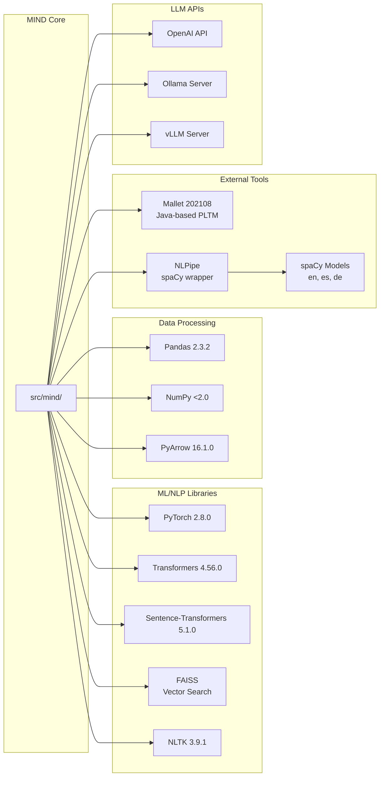
```mermaid
graph LR
    subgraph "MIND Core"
        Core[src/mind/]
    end
    
    subgraph "ML/NLP Libraries"
        PyTorch[PyTorch 2.8.0]
        Transformers[Transformers 4.56.0]
        SentTrans[Sentence-Transformers 5.1.0]
        FAISS[FAISS<br/>Vector Search]
        NLTK[NLTK 3.9.1]
    end
    
    subgraph "Data Processing"
        Pandas[Pandas 2.3.2]
        NumPy[NumPy <2.0]
        PyArrow[PyArrow 16.1.0]
    end
    
    subgraph "External Tools"
        Mallet[Mallet 202108<br/>Java-based PLTM]
        NLPipe[NLPipe<br/>spaCy wrapper]
        spaCy[spaCy Models<br/>en, es, de]
    end
    
    subgraph "LLM APIs"
        OpenAI[OpenAI API]
        Ollama[Ollama Server]
        vLLM[vLLM Server]
    end
    
    Core --> PyTorch
    Core --> Transformers
    Core --> SentTrans
    Core --> FAISS
    Core --> NLTK
    Core --> Pandas
    Core --> NumPy
    Core --> PyArrow
    Core --> Mallet
    Core --> NLPipe
    NLPipe --> spaCy
    Core --> OpenAI
    Core --> Ollama
    Core --> vLLM
```

---

## 4. Web Application Architecture

### 4.1 Frontend Service Structure

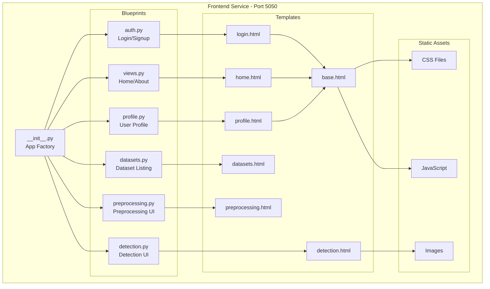
```mermaid
graph TB
    subgraph "Frontend Service - Port 5050"
        Init[__init__.py<br/>App Factory]
        
        subgraph "Blueprints"
            AuthBP[auth.py<br/>Login/Signup]
            ViewsBP[views.py<br/>Home/About]
            ProfileBP[profile.py<br/>User Profile]
            DatasetsBP[datasets.py<br/>Dataset Listing]
            PreprocBP[preprocessing.py<br/>Preprocessing UI]
            DetectBP[detection.py<br/>Detection UI]
        end
        
        subgraph "Templates"
            Base[base.html]
            Login[login.html]
            Home[home.html]
            Profile[profile.html]
            Datasets[datasets.html]
            Preproc[preprocessing.html]
            Detection[detection.html]
        end
        
        subgraph "Static Assets"
            CSS[CSS Files]
            JS[JavaScript]
            Images[Images]
        end
    end
    
    Init --> AuthBP
    Init --> ViewsBP
    Init --> ProfileBP
    Init --> DatasetsBP
    Init --> PreprocBP
    Init --> DetectBP
    
    AuthBP --> Login
    ViewsBP --> Home
    ProfileBP --> Profile
    DatasetsBP --> Datasets
    PreprocBP --> Preproc
    DetectBP --> Detection
    
    Login --> Base
    Home --> Base
    Profile --> Base
    
    Base --> CSS
    Base --> JS
    Detection --> Images
```

### 4.2 Backend Service Structure

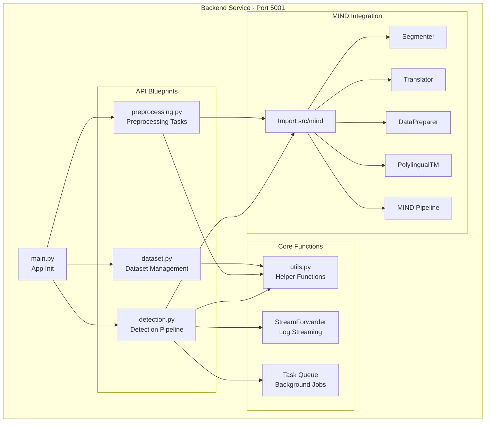
```mermaid
graph TB
    subgraph "Backend Service - Port 5001"
        Main[main.py<br/>App Init]
        
        subgraph "API Blueprints"
            DatasetAPI[dataset.py<br/>Dataset Management]
            PreprocAPI[preprocessing.py<br/>Preprocessing Tasks]
            DetectAPI[detection.py<br/>Detection Pipeline]
        end
        
        subgraph "Core Functions"
            Utils[utils.py<br/>Helper Functions]
            Stream[StreamForwarder<br/>Log Streaming]
            Queue[Task Queue<br/>Background Jobs]
        end
        
        subgraph "MIND Integration"
            Import[Import src/mind]
            Seg[Segmenter]
            Trans[Translator]
            Prep[DataPreparer]
            TM[PolylingualTM]
            Pipeline[MIND Pipeline]
        end
    end
    
    Main --> DatasetAPI
    Main --> PreprocAPI
    Main --> DetectAPI
    
    DatasetAPI --> Utils
    PreprocAPI --> Utils
    DetectAPI --> Utils
    DetectAPI --> Stream
    DetectAPI --> Queue
    
    PreprocAPI --> Import
    DetectAPI --> Import
    Import --> Seg
    Import --> Trans
    Import --> Prep
    Import --> TM
    Import --> Pipeline
```

### 4.3 Request Flow - Dataset Upload

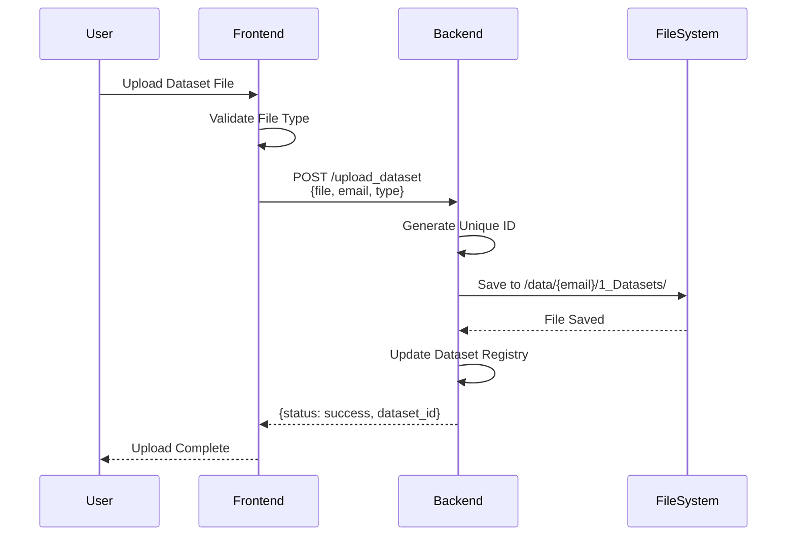
```mermaid
sequenceDiagram
    participant User
    participant Frontend
    participant Backend
    participant FileSystem
    
    User->>Frontend: Upload Dataset File
    Frontend->>Frontend: Validate File Type
    Frontend->>Backend: POST /upload_dataset<br/>{file, email, type}
    Backend->>Backend: Generate Unique ID
    Backend->>FileSystem: Save to /data/{email}/1_Datasets/
    FileSystem-->>Backend: File Saved
    Backend->>Backend: Update Dataset Registry
    Backend-->>Frontend: {status: success, dataset_id}
    Frontend-->>User: Upload Complete
```

### 4.4 Request Flow - Run Detection

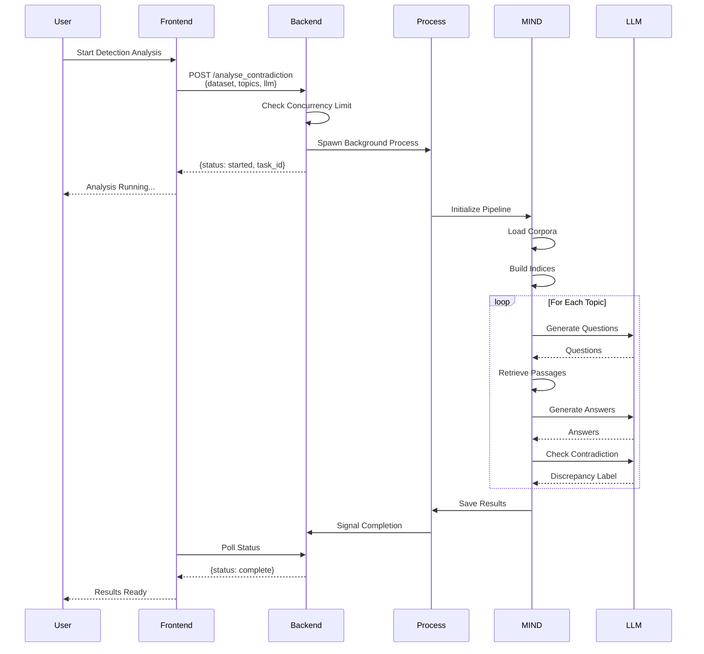
```mermaid
sequenceDiagram
    participant User
    participant Frontend
    participant Backend
    participant Process
    participant MIND
    participant LLM
    
    User->>Frontend: Start Detection Analysis
    Frontend->>Backend: POST /analyse_contradiction<br/>{dataset, topics, llm}
    Backend->>Backend: Check Concurrency Limit
    Backend->>Process: Spawn Background Process
    Backend-->>Frontend: {status: started, task_id}
    Frontend-->>User: Analysis Running...
    
    Process->>MIND: Initialize Pipeline
    MIND->>MIND: Load Corpora
    MIND->>MIND: Build Indices
    
    loop For Each Topic
        MIND->>LLM: Generate Questions
        LLM-->>MIND: Questions
        MIND->>MIND: Retrieve Passages
        MIND->>LLM: Generate Answers
        LLM-->>MIND: Answers
        MIND->>LLM: Check Contradiction
        LLM-->>MIND: Discrepancy Label
    end
    
    MIND->>Process: Save Results
    Process->>Backend: Signal Completion
    
    Frontend->>Backend: Poll Status
    Backend-->>Frontend: {status: complete}
    Frontend-->>User: Results Ready
```

---

## 5. MIND Pipeline Workflow

### 5.1 Complete Pipeline Execution

```mermaid
flowchart TD
    Start([Initialize MIND]) --> LoadConfig[Load Configuration<br/>config.yaml]
    LoadConfig --> InitLLM[Initialize LLM<br/>Prompter]
    InitLLM --> LoadCorpora[Load Source & Target<br/>Corpora]
    
    LoadCorpora --> BuildIndex{Build Retrieval<br/>Index?}
    BuildIndex -->|Yes| CreateIndex[Create FAISS Index<br/>IndexRetriever]
    BuildIndex -->|No| LoadIndex[Load Existing Index]
    CreateIndex --> SelectTopics
    LoadIndex --> SelectTopics
    
    SelectTopics[Select Topics<br/>to Analyze] --> LoopTopics{For Each<br/>Topic}
    
    LoopTopics --> SampleChunks[Sample Source Chunks<br/>from Topic]
    SampleChunks --> LoopChunks{For Each<br/>Chunk}
    
    LoopChunks --> GenQ[Generate Questions<br/>LLM Prompt]
    GenQ --> FilterQ[Filter Bad Questions<br/>Heuristics]
    FilterQ --> LoopQ{For Each<br/>Question}
    
    LoopQ --> GenSubQ[Generate Subqueries<br/>Decompose Question]
    GenSubQ --> LoopSubQ{For Each<br/>Subquery}
    
    LoopSubQ --> Retrieve[Retrieve Target Chunks<br/>TB-ENN/TB-ANN]
    Retrieve --> LoopTarget{For Each<br/>Target Chunk}
    
    LoopTarget --> CheckRel[Check Relevance<br/>LLM Prompt]
    CheckRel --> IsRel{Relevant?}
    IsRel -->|No| NextTarget[Next Target]
    IsRel -->|Yes| GenAnsS[Generate Answer Source<br/>LLM Prompt]
    
    GenAnsS --> GenAnsT[Generate Answer Target<br/>LLM Prompt]
    GenAnsT --> CheckContra[Check Contradiction<br/>LLM Prompt]
    CheckContra --> IsContra{Contradiction?}
    
    IsContra -->|No| NextTarget
    IsContra -->|Yes| OptNLI{Use NLI<br/>Verification?}
    OptNLI -->|Yes| RunNLI[Run NLI Model<br/>DeBERTa-MNLI]
    OptNLI -->|No| LogDisc
    RunNLI --> LogDisc[Log Discrepancy<br/>Save to Results]
    
    LogDisc --> NextTarget
    NextTarget --> LoopTarget
    LoopTarget -->|Done| NextSubQ[Next Subquery]
    NextSubQ --> LoopSubQ
    LoopSubQ -->|Done| NextQ[Next Question]
    NextQ --> LoopQ
    LoopQ -->|Done| NextChunk[Next Chunk]
    NextChunk --> LoopChunks
    LoopChunks -->|Done| NextTopic[Next Topic]
    NextTopic --> LoopTopics
    LoopTopics -->|Done| SaveResults[Save Results<br/>Parquet]
    
    SaveResults --> End([Pipeline Complete])
    
    style GenQ fill:#c8e6c9
    style Retrieve fill:#b2dfdb
    style GenAnsS fill:#b2ebf2
    style GenAnsT fill:#b2ebf2
    style CheckContra fill:#ffecb3
    style LogDisc fill:#ffccbc
```

### 5.2 Question Generation Detail

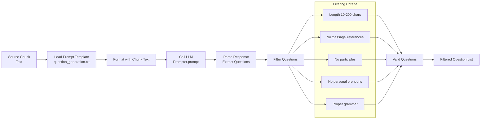
```mermaid
flowchart LR
    Input[Source Chunk<br/>Text] --> LoadPrompt[Load Prompt Template<br/>question_generation.txt]
    LoadPrompt --> FormatPrompt[Format with Chunk Text]
    FormatPrompt --> CallLLM[Call LLM<br/>Prompter.prompt]
    CallLLM --> ParseResp[Parse Response<br/>Extract Questions]
    ParseResp --> Filter[Filter Questions]
    
    subgraph "Filtering Criteria"
        F1[Length 10-200 chars]
        F2[No 'passage' references]
        F3[No participles]
        F4[No personal pronouns]
        F5[Proper grammar]
    end
    
    Filter --> F1
    Filter --> F2
    Filter --> F3
    Filter --> F4
    Filter --> F5
    
    F1 --> Valid[Valid Questions]
    F2 --> Valid
    F3 --> Valid
    F4 --> Valid
    F5 --> Valid
    
    Valid --> Output[Filtered Question List]
```

---

## 6. Retrieval System Architecture

### 6.1 IndexRetriever Methods

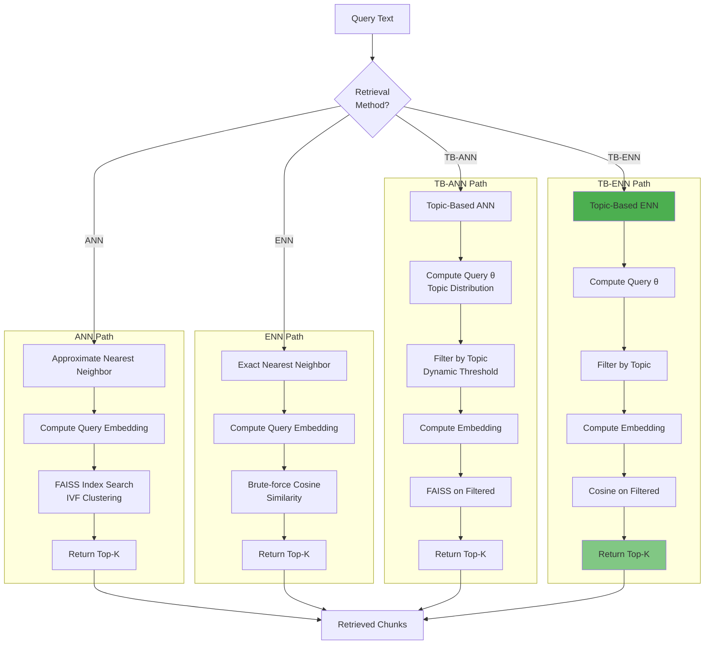
```mermaid
graph TB
    Query[Query Text] --> Method{Retrieval<br/>Method?}
    
    Method -->|ANN| ANN[Approximate Nearest Neighbor]
    Method -->|ENN| ENN[Exact Nearest Neighbor]
    Method -->|TB-ANN| TBANN[Topic-Based ANN]
    Method -->|TB-ENN| TBENN[Topic-Based ENN]
    
    subgraph "ANN Path"
        ANN --> Embed1[Compute Query Embedding]
        Embed1 --> FAISS1[FAISS Index Search<br/>IVF Clustering]
        FAISS1 --> TopK1[Return Top-K]
    end
    
    subgraph "ENN Path"
        ENN --> Embed2[Compute Query Embedding]
        Embed2 --> Cosine[Brute-force Cosine<br/>Similarity]
        Cosine --> TopK2[Return Top-K]
    end
    
    subgraph "TB-ANN Path"
        TBANN --> Theta1[Compute Query θ<br/>Topic Distribution]
        Theta1 --> Filter1[Filter by Topic<br/>Dynamic Threshold]
        Filter1 --> Embed3[Compute Embedding]
        Embed3 --> FAISS2[FAISS on Filtered]
        FAISS2 --> TopK3[Return Top-K]
    end
    
    subgraph "TB-ENN Path"
        TBENN --> Theta2[Compute Query θ]
        Theta2 --> Filter2[Filter by Topic]
        Filter2 --> Embed4[Compute Embedding]
        Embed4 --> Cosine2[Cosine on Filtered]
        Cosine2 --> TopK4[Return Top-K]
    end
    
    TopK1 --> Results[Retrieved Chunks]
    TopK2 --> Results
    TopK3 --> Results
    TopK4 --> Results
    
    style TBENN fill:#4caf50
    style TopK4 fill:#81c784
```

### 6.2 Topic-Based Filtering

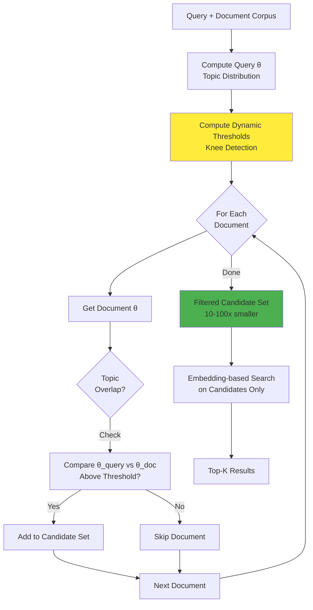
```mermaid
flowchart TD
    Start[Query + Document Corpus] --> ComputeTheta[Compute Query θ<br/>Topic Distribution]
    ComputeTheta --> DynThresh[Compute Dynamic Thresholds<br/>Knee Detection]
    
    DynThresh --> LoopDocs{For Each<br/>Document}
    LoopDocs --> GetDocTheta[Get Document θ]
    GetDocTheta --> CheckOverlap{Topic<br/>Overlap?}
    
    CheckOverlap -->|Check| Compare[Compare θ_query vs θ_doc<br/>Above Threshold?]
    Compare -->|Yes| AddCandidate[Add to Candidate Set]
    Compare -->|No| Skip[Skip Document]
    
    AddCandidate --> NextDoc[Next Document]
    Skip --> NextDoc
    NextDoc --> LoopDocs
    
    LoopDocs -->|Done| Candidates[Filtered Candidate Set<br/>10-100x smaller]
    Candidates --> EmbedSearch[Embedding-based Search<br/>on Candidates Only]
    EmbedSearch --> Results[Top-K Results]
    
    style DynThresh fill:#ffeb3b
    style Candidates fill:#4caf50
```

### 6.3 Dynamic Threshold Calculation

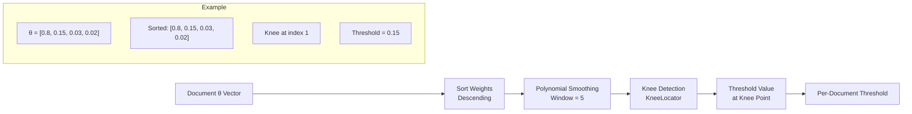
```mermaid
flowchart LR
    Input[Document θ Vector] --> Sort[Sort Weights<br/>Descending]
    Sort --> Smooth[Polynomial Smoothing<br/>Window = 5]
    Smooth --> Knee[Knee Detection<br/>KneeLocator]
    Knee --> Threshold[Threshold Value<br/>at Knee Point]
    
    subgraph "Example"
        Ex1["θ = [0.8, 0.15, 0.03, 0.02]"]
        Ex2["Sorted: [0.8, 0.15, 0.03, 0.02]"]
        Ex3["Knee at index 1"]
        Ex4["Threshold = 0.15"]
    end
    
    Threshold --> Output[Per-Document Threshold]
```

---

## 7. LLM Integration

### 7.1 Prompter Architecture

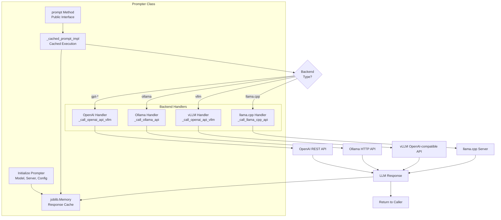
```mermaid
graph TB
    subgraph "Prompter Class"
        Init[Initialize Prompter<br/>Model, Server, Config]
        Cache[joblib.Memory<br/>Response Cache]
        
        subgraph "Backend Handlers"
            OpenAI[OpenAI Handler<br/>_call_openai_api_vllm]
            Ollama[Ollama Handler<br/>_call_ollama_api]
            vLLM[vLLM Handler<br/>_call_openai_api_vllm]
            LlamaCpp[llama.cpp Handler<br/>_call_llama_cpp_api]
        end
        
        Prompt[prompt Method<br/>Public Interface]
        Cached[_cached_prompt_impl<br/>Cached Execution]
    end
    
    Init --> Cache
    Prompt --> Cached
    Cached --> Cache
    
    Cached --> Backend{Backend<br/>Type?}
    Backend -->|gpt-*| OpenAI
    Backend -->|ollama| Ollama
    Backend -->|vllm| vLLM
    Backend -->|llama.cpp| LlamaCpp
    
    OpenAI --> API1[OpenAI REST API]
    Ollama --> API2[Ollama HTTP API]
    vLLM --> API3[vLLM OpenAI-compatible API]
    LlamaCpp --> API4[llama.cpp Server]
    
    API1 --> Response[LLM Response]
    API2 --> Response
    API3 --> Response
    API4 --> Response
    
    Response --> Cache
    Response --> Return[Return to Caller]
```

### 7.2 Prompt Template Flow

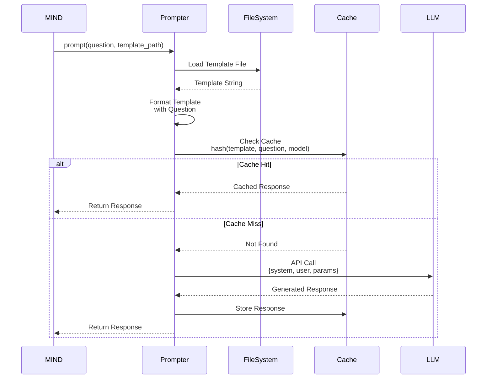
```mermaid
sequenceDiagram
    participant MIND
    participant Prompter
    participant FileSystem
    participant Cache
    participant LLM
    
    MIND->>Prompter: prompt(question, template_path)
    Prompter->>FileSystem: Load Template File
    FileSystem-->>Prompter: Template String
    Prompter->>Prompter: Format Template<br/>with Question
    Prompter->>Cache: Check Cache<br/>hash(template, question, model)
    
    alt Cache Hit
        Cache-->>Prompter: Cached Response
        Prompter-->>MIND: Return Response
    else Cache Miss
        Cache-->>Prompter: Not Found
        Prompter->>LLM: API Call<br/>{system, user, params}
        LLM-->>Prompter: Generated Response
        Prompter->>Cache: Store Response
        Prompter-->>MIND: Return Response
    end
```

### 7.3 Supported LLM Models

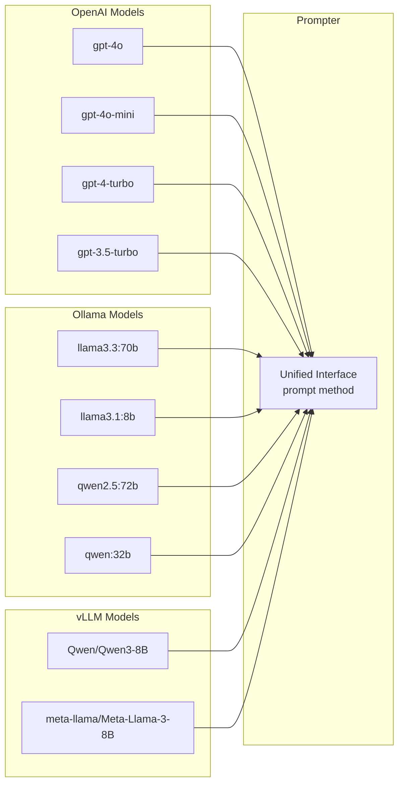
```mermaid
graph LR
    subgraph "OpenAI Models"
        GPT4o[gpt-4o]
        GPT4mini[gpt-4o-mini]
        GPT4turbo[gpt-4-turbo]
        GPT35[gpt-3.5-turbo]
    end
    
    subgraph "Ollama Models"
        Llama33[llama3.3:70b]
        Llama31[llama3.1:8b]
        Qwen25[qwen2.5:72b]
        Qwen32[qwen:32b]
    end
    
    subgraph "vLLM Models"
        Qwen3[Qwen/Qwen3-8B]
        LlamaVLLM[meta-llama/Meta-Llama-3-8B]
    end
    
    subgraph "Prompter"
        Interface[Unified Interface<br/>prompt method]
    end
    
    GPT4o --> Interface
    GPT4mini --> Interface
    GPT4turbo --> Interface
    GPT35 --> Interface
    Llama33 --> Interface
    Llama31 --> Interface
    Qwen25 --> Interface
    Qwen32 --> Interface
    Qwen3 --> Interface
    LlamaVLLM --> Interface
```

---

## 8. Deployment Architecture

### 8.1 Docker Compose Services

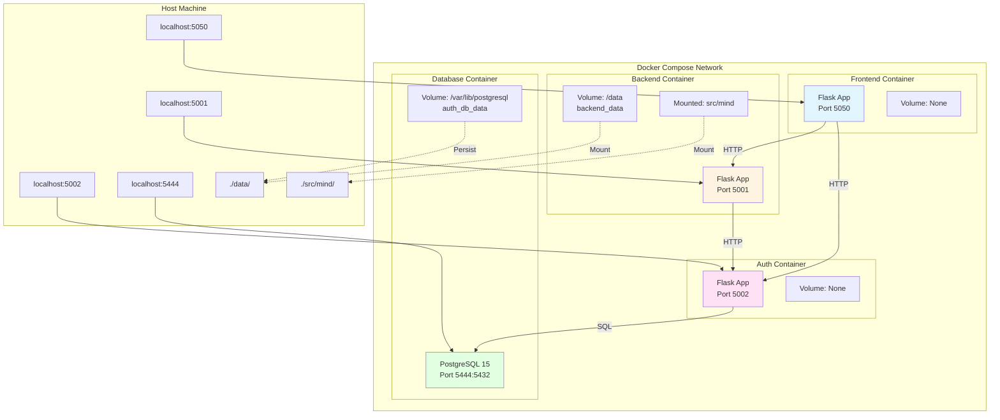
```mermaid
graph TB
    subgraph "Docker Compose Network"
        subgraph "Frontend Container"
            FrontendApp[Flask App<br/>Port 5050]
            FrontendVol[Volume: None]
        end
        
        subgraph "Backend Container"
            BackendApp[Flask App<br/>Port 5001]
            BackendVol[Volume: /data<br/>backend_data]
            MINDLib[Mounted: src/mind]
        end
        
        subgraph "Auth Container"
            AuthApp[Flask App<br/>Port 5002]
            AuthVol[Volume: None]
        end
        
        subgraph "Database Container"
            PostgreSQL[PostgreSQL 15<br/>Port 5444:5432]
            DBVol[Volume: /var/lib/postgresql<br/>auth_db_data]
        end
    end
    
    subgraph "Host Machine"
        Port5050[localhost:5050]
        Port5001[localhost:5001]
        Port5002[localhost:5002]
        Port5444[localhost:5444]
        DataDir[./data/]
        SrcDir[./src/mind/]
    end
    
    Port5050 --> FrontendApp
    Port5001 --> BackendApp
    Port5002 --> AuthApp
    Port5444 --> PostgreSQL
    
    FrontendApp -->|HTTP| BackendApp
    FrontendApp -->|HTTP| AuthApp
    BackendApp -->|HTTP| AuthApp
    AuthApp -->|SQL| PostgreSQL
    
    BackendVol -.->|Mount| DataDir
    MINDLib -.->|Mount| SrcDir
    DBVol -.->|Persist| DataDir
    
    style FrontendApp fill:#e1f5ff
    style BackendApp fill:#fff4e1
    style AuthApp fill:#ffe1f5
    style PostgreSQL fill:#e1ffe1
```

### 8.2 Service Dependencies

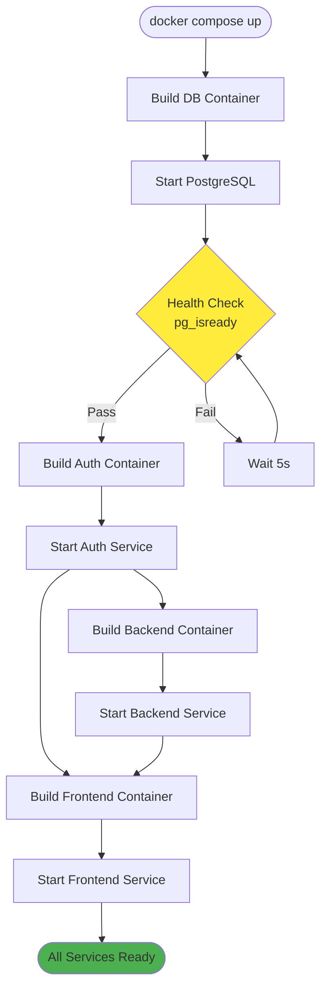
```mermaid
graph TD
    Start([docker compose up]) --> BuildDB[Build DB Container]
    BuildDB --> StartDB[Start PostgreSQL]
    StartDB --> HealthCheck{Health Check<br/>pg_isready}
    
    HealthCheck -->|Pass| BuildAuth[Build Auth Container]
    HealthCheck -->|Fail| Wait[Wait 5s]
    Wait --> HealthCheck
    
    BuildAuth --> StartAuth[Start Auth Service]
    StartAuth --> BuildBackend[Build Backend Container]
    BuildBackend --> StartBackend[Start Backend Service]
    
    StartAuth --> BuildFrontend[Build Frontend Container]
    StartBackend --> BuildFrontend
    BuildFrontend --> StartFrontend[Start Frontend Service]
    
    StartFrontend --> Ready([All Services Ready])
    
    style HealthCheck fill:#ffeb3b
    style Ready fill:#4caf50
```

### 8.3 Data Persistence

```mermaid
graph LR
    subgraph "Docker Volumes"
        AuthDB[auth_db_data<br/>PostgreSQL Data]
        BackendData[backend_data<br/>User Files]
    end
    
    subgraph "Backend Data Structure"
        Root[/data/]
        User1[{email1}/]
        User2[{email2}/]
        
        subgraph "User Directory"
            Datasets[1_Datasets/<br/>Raw & Preprocessed]
            Segmented[2_Segmented/<br/>Segmented Data]
            Translated[3_Translated/<br/>Translated Data]
            Detection[4_Detection/<br/>Results]
            Models[5_Models/<br/>Topic Models]
        end
    end
    
    BackendData --> Root
    Root --> User1
    Root --> User2
    User1 --> Datasets
    User1 --> Segmented
    User1 --> Translated
    User1 --> Detection
    User1 --> Models
```

---

## 9. Database Schema

### 9.1 Auth Database

```mermaid
erDiagram
    USERS {
        serial id PK
        varchar name
        varchar email UK
        varchar password
        timestamp created_at
    }
    
    SESSIONS {
        varchar session_id PK
        int user_id FK
        timestamp created_at
        timestamp expires_at
        text jwt_token
    }
    
    USERS ||--o{ SESSIONS : has
```

### 9.2 Data Model Relationships

```mermaid
classDiagram
    class User {
        +int id
        +string name
        +string email
        +string password_hash
        +datetime created_at
        +login()
        +validate_password()
    }
    
    class Dataset {
        +string dataset_id
        +string user_email
        +string name
        +string type
        +string path
        +datetime uploaded_at
        +int num_rows
    }
    
    class TopicModel {
        +string model_id
        +string dataset_id
        +int num_topics
        +string lang1
        +string lang2
        +string model_path
        +datetime trained_at
    }
    
    class DetectionResult {
        +string result_id
        +string model_id
        +list topics
        +string llm_model
        +string result_path
        +datetime created_at
        +int num_discrepancies
    }
    
    User "1" --> "*" Dataset : owns
    Dataset "1" --> "*" TopicModel : has
    TopicModel "1" --> "*" DetectionResult : generates
```

---

## 10. Configuration Flow

### 10.1 Configuration Loading

```mermaid
flowchart TD
    Start([Application Start]) --> LoadEnv[Load .env Files<br/>python-dotenv]
    LoadEnv --> LoadYAML[Load config.yaml<br/>PyYAML]
    
    LoadYAML --> ParseConfig{Parse<br/>Sections}
    
    ParseConfig --> Logger[Logger Config<br/>dir, level, format]
    ParseConfig --> MIND[MIND Config<br/>top_k, batch_size]
    ParseConfig --> LLM[LLM Config<br/>models, hosts, params]
    ParseConfig --> Prompts[Prompt Paths<br/>template files]
    ParseConfig --> Embeddings[Embedding Models<br/>multilingual, monolingual]
    
    Logger --> InitLogger[Initialize Logger<br/>File + Console]
    MIND --> InitMIND[Initialize MIND<br/>Pipeline]
    LLM --> InitPrompter[Initialize Prompter<br/>LLM Backends]
    Prompts --> LoadTemplates[Load Prompt<br/>Templates]
    Embeddings --> InitRetriever[Initialize Retriever<br/>Sentence Transformers]
    
    InitLogger --> Ready
    InitMIND --> Ready
    InitPrompter --> Ready
    LoadTemplates --> Ready
    InitRetriever --> Ready
    
    Ready([Configuration Complete])
    
    style LoadEnv fill:#ffeb3b
    style LoadYAML fill:#ff9800
    style Ready fill:#4caf50
```

### 10.2 Environment Variables Hierarchy

```mermaid
graph TB
    subgraph "Environment Files"
        RootEnv[.env<br/>Root Level]
        FrontendEnv[app/frontend/.env]
        BackendEnv[app/backend/.env]
        AuthEnv[app/auth/.env]
    end
    
    subgraph "Configuration Files"
        ConfigYAML[config/config.yaml]
        ConfigJSON[config.json]
    end
    
    subgraph "Application Components"
        Frontend[Frontend Service]
        Backend[Backend Service]
        Auth[Auth Service]
        MIND[MIND Library]
    end
    
    RootEnv -->|OPENAI_API_KEY| MIND
    FrontendEnv -->|WEB_APP_KEY| Frontend
    FrontendEnv -->|MAX_CONCURRENT_TASKS| Frontend
    BackendEnv -->|MAX_USERS_DETECTION| Backend
    AuthEnv -->|DATABASE_URL| Auth
    AuthEnv -->|SECRET_KEY| Auth
    
    ConfigYAML -->|Logger, LLM, MIND| MIND
    ConfigJSON -->|NLPipe Config| MIND
    
    style RootEnv fill:#ffeb3b
    style ConfigYAML fill:#ff9800
```

### 10.3 Prompt Template System

```mermaid
graph LR
    subgraph "Prompt Templates"
        QGen[question_generation.txt]
        SubQ[query_generation.txt]
        AGen[question_answering.txt]
        Contra[discrepancy_detection.txt]
        Rel[relevance_checking.txt]
        TLabel[topic_label.txt]
    end
    
    subgraph "Config Mapping"
        Config[config.yaml<br/>prompts section]
    end
    
    subgraph "Pipeline Usage"
        GenQ[Generate Questions]
        GenSubQ[Generate Subqueries]
        GenAns[Generate Answers]
        CheckContra[Check Contradiction]
        CheckRel[Check Relevance]
        LabelTopic[Label Topics]
    end
    
    Config --> QGen
    Config --> SubQ
    Config --> AGen
    Config --> Contra
    Config --> Rel
    Config --> TLabel
    
    QGen --> GenQ
    SubQ --> GenSubQ
    AGen --> GenAns
    Contra --> CheckContra
    Rel --> CheckRel
    TLabel --> LabelTopic
```

---

## Appendix: Diagram Legend

### Node Shapes
- **Rectangle**: Process or Component
- **Rounded Rectangle**: Start/End Point
- **Diamond**: Decision Point
- **Cylinder**: Database
- **Folder**: File Storage
- **Hexagon**: External Service

### Colors
- **Blue** (#e1f5ff): Frontend Components
- **Yellow** (#fff4e1): Backend Components
- **Pink** (#ffe1f5): Auth Components
- **Green** (#e1ffe1): Core Library
- **Light Green** (#c8e6c9): LLM Operations
- **Cyan** (#b2ebf2): Data Processing
- **Amber** (#ffecb3): Detection/Analysis

### Arrow Types
- **Solid Arrow** (→): Data Flow / Function Call
- **Dashed Arrow** (⇢): Configuration / Reference
- **Thick Arrow** (⟹): Main Process Flow

---

**End of Architecture Diagrams**
